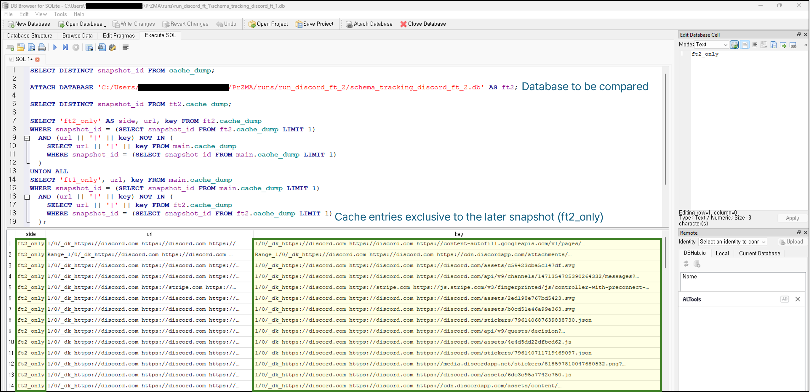
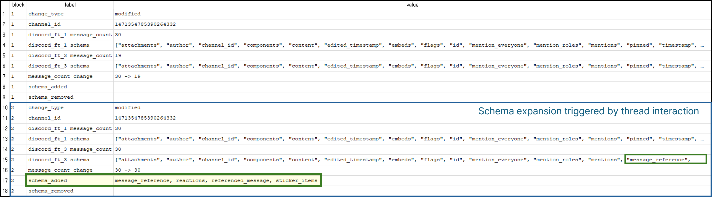

# [DFRWS USA 2026] PrZMA  
**Prompt-Guided Zero-Touch Multi-Interaction Agent for Generating Forensic Datasets in Multi-Platform Environments**

This repository is the **official repository** of *PrZMA*, a framework submitted to **DFRWS USA 2026**.  
PrZMA leverages **LLM-driven planning and automation** to generate **reproducible, action-grounded digital forensic datasets** across **multi-user, multi-platform environments**.

📑 Table of Contents

- [Overview](#-overview)
- [Key Features](#key-features)
- [Multi-Layer Artifact Collection](#multi-layer-artifact-collection)
- [Supported Applications & Scenarios](#supported-applications--scenarios)
- [Repository Structure](#-repository-structure)
- [Requirements](#requirements)
- [Demo](#-demo)
- [All Trigger Mode (Tool Testing)](#-all-trigger-mode-tool-testing)
- [Typical Use Cases](#-typical-use-cases)

## 🔍 Overview

Digital forensic research/education and tool validation require realistic, well-documented datasets.  
However, real-world data is difficult to share due to privacy, legal, and ethical constraints.

**PrZMA** addresses this challenge by introducing a **Prompt-Guided, Zero-Touch automation framework** that:

- Interprets **forensic tool manuals** using an LLM (GPT-5.2)
- Automatically executes **human-like interactions** across browsers and services
- Captures **logical snapshots** of forensic artifacts at controlled points in time
- Produces **tool-ready datasets** for education, evaluation, and regression testing

PrZMA is designed for **both education-oriented scenarios** and **forensic tool testing workflows**, without requiring manual interaction during execution.

---

## Key Features

- **Tool Manual Interpreter (TMI)**  
  Converts unstructured forensic tool documentation (PDF / web pages) into a structured execution plan:
  - Supported services and platforms  
  - Target artifact types  
  - Action boundaries and constraints  

- **Prompt-Guided Automation Agent**  
  Executes interactions using an LLM-driven planner with a strictly bounded action space:
  - Multi-user and multi-agent coordination  
  - Browser-based services (e.g., Discord Web, Telegram Web)  
  - Zero-touch execution after initial configuration  

- **Logical Snapshot Engine**  
  Captures forensic artifacts based on:
  - Time-based triggers  
  - Action-based triggers  
  - Platform-aware path resolution (VM-side)  

- **Dual-Purpose Design**
  - **Education**: realistic analyst-style interactions and artifact generation  
  - **Tool Testing**: reproducible datasets for validating forensic tools and detecting artifact drift  
    - **All Trigger Mode**: Exhaustively activates UI elements and performs action-level logical snapshots to induce functionality-driven artifact schema changes.

---

## Multi-Layer Artifact Collection

PrZMA collects **multi-layer forensic artifacts** through **action-triggered logical snapshots**.  
Instead of full disk imaging, the system captures artifacts across **browser**, **cloud-reflected**,  
and **system** layers, preserving realistic interaction-driven traces.

### 🌐 Browser Artifacts (Chromium-Based)

| Layer | Artifact Category | Collected Items |
|------|------------------|-----------------|
| Browser | Core Profile Data | History, Cookies, Login Data, Preferences, Secure Preferences, Bookmarks, Web Data |
| Browser | Web Storage | IndexedDB, Local Storage, Session Storage |
| Browser | Service Worker | Service Worker storage |
| Browser | Cache | CacheStorage, HTTP Cache (Cache_Data) |
| Browser | Execution Cache | Code Cache (JavaScript bytecode) |
| Browser | Network Metadata | Network state, TransportSecurity, Reporting/NEL |

### ☁️ Cloud-Reflected Web Application Artifacts

Local browser-side traces of cloud services accessed via web applications.

| Layer | Application | Collected Artifacts |
|------|------------|---------------------|
| Cloud-Reflected | Discord Web | IndexedDB, Local Storage, Session Storage, Service Worker, CacheStorage, Code Cache |
| Cloud-Reflected | Telegram Web | IndexedDB, Local Storage, Session Storage, Service Worker, CacheStorage, Code Cache |

### 🖥️ System Artifacts (Windows)

Artifacts reflecting system-level execution and user interaction.

| Layer | Category | Collected Items |
|------|---------|-----------------|
| System | Event Logs | Windows Event Logs (EVTX) |
| System | Execution Traces | Prefetch, Amcache, SRUM |
| System | Registry (Source) | NTUSER.DAT, UsrClass.dat, SYSTEM, SOFTWARE, SAM, SECURITY |
| System | User Activity | Recent Items (LNK), Jump Lists |
| System | Filesystem | User Downloads folder |
| System | Tasks & Services | Scheduled Tasks (XML), Service configuration |
| System | Temporary Data | User/System Temp directories (rule-limited) |

---

## Supported Applications & Scenarios

PrZMA currently focuses on **web-centric forensic scenarios**, including:

- **Web Browsing (Chromium-based)**
  - Google Chrome / Microsoft Edge  
  - Search, navigation, scrolling, clicking, downloads  

- **Cloud-based Messaging (Web Applications)**
  - Discord Web (multi-agent conversations, file exchange)  
  - Telegram Web (planned / experimental)

These scenarios are sufficient to reproduce **realistic artifact footprints** commonly examined in modern investigations.

---

## 🗂️ Repository Structure

**`Automation_Agent/`**  
- Executes LLM-planned actions within a strictly defined action boundary.

**`Tool_Manual_Interpreter/`**  
- Interprets tool manuals or specifications to derive required interactions and target artifacts.

**`Snapshot_Engine/`**  
- Manages action- or time-triggered snapshots and artifact collection rules.

**`VM_Agent/`**  
- Runs inside the target VM and performs actual interactions (browser, Discord, etc.).
- **Note**: All paths are used as-is inside the VM environment. (Please refer to the VM Preparation section below)

**`shared/`**  
- Common schemas, action definitions, and wire formats shared across components.

**`main.py`** 
- Entry point that initializes the pipeline and coordinates interpreter, agent, and snapshot execution.

**`przma_config.json`** 
- Unified configuration describing agents, platforms, scenarios, and snapshot policies.

**`przma_education.ps1`** 
- Launcher script for education-oriented multi-agent scenarios.

**`przma_tooltest.ps1`** 
- Launcher script for tool-testing and validation workflows.

---

## Requirements

- Windows host with VMware Workstation
- Python 3.10+
- Playwright (Chromium-based browsers)
- OpenAI API access (GPT-5.2)
- Multiple Windows VMs for multi-agent scenarios

### VM Preparation

For multi-agent execution, PrZMA requires **Windows virtual machines configured identically to the host environment**.

1. Create one or more Windows VMs using VMware Workstation  
   (same OS version and browser environment as the host is recommended).

2. Inside each VM, copy the `VM_Agent/` directory to the root path: `C:\VM_Agent\`

3. From an elevated PowerShell session inside the VM, initialize the agent by running: `init.ps1`

4. Once initialized, the VM Agent runs in the background and waits for commands from the host-side controller.

Each VM represents an independent agent and can participate in multi-user or multi-platform scenarios. (For most scenarios, users only need to modify `przma_config.json`.)

## 🎬 Demo
This demo runs `przma_education_config.json` in a realistic forensic triage scenario.

Three investigators meet in a Discord channel:
- **Alice (Agent1)** – Team leader. Coordinates the triage, assigns tasks, and keeps the discussion focused.
- **Bob (Agent2)** – Browser cache & timeline specialist. Verifies Chromium artifacts and execution traces.
- **Eve (Agent3)** – OSINT-oriented analyst. Cross-checks Discord storage artifacts and challenges assumptions.
  
They conduct a short, time-boxed investigation:
- Alice assigns roles and sets priorities.
- Bob and Eve perform web lookups to verify artifact locations.
- One agent uploads an evidence-style file (e.g., IOC list, timeline CSV).
- The discussion ends with a concise triage plan.

During execution, the Snapshot Engine performs **time-based and action-based logical snapshots**, collecting:

- `chromium.cache.cache_data`
- `webapp.discord.chromium.storage`

The demo illustrates how PrZMA generates realistic, role-driven interactions and reproducible forensic artifacts under controlled snapshot policies.

## 🧪 All Trigger Mode (Tool Testing)

In Tool Testing mode, PrZMA provides an **All Trigger** strategy that systematically activates all detectable clickable UI elements within a bounded Action Space.

Rather than reproducing a single user workflow, this mode exhaustively explores the functionality surface of a service in order to induce conditionally generated artifacts.

In All Trigger mode, a **Logical Snapshot is executed at every action (action-level snapshotting).**

For each action-level Logical Snapshot, PrZMA performs the following:

- Collects the HTML source code, DOM object structure, and rendered screenshot at that specific state  
- Extracts IndexedDB, LevelDB, and Chromium Cache artifacts, interprets them using **ccl_chromium_reader**, and stores the parsed results in a unified Tracking DB  

This enables structured cross-snapshot comparison and quantitative observation of state changes induced by service functionality.

---

## 🔎 Demonstration: Discord Snapshot Comparison

Three All Trigger executions were performed on Discord Web:

- `discord_ft1` : Baseline execution  
- `discord_ft2` : Additional standard interactions  
- `discord_ft3` : Thread creation and interaction within the thread  

All execution results were stored in the Tracking DB and compared using SQLite queries.

---

### #1. Cache Diff (`discord_ft1` vs `discord_ft2`)

The following result shows cache entries present only in `discord_ft2` compared to `discord_ft1`.

Entries labeled `ft2_only` represent URL/key pairs observed exclusively in the later snapshot (`discord_ft2.cache_dump`).  
These indicate newly generated cache data triggered by additional interactions.

---

### #2. Schema Change (`discord_ft1` vs `discord_ft3`)

During `discord_ft3`, a thread was created within an existing channel, followed by interactions inside that thread.

The comparison below shows structural differences between `discord_ft1` and `discord_ft3`.

The following newly observed fields were identified:

- `message_reference`
- `reactions`
- `referenced_message`
- `sticker_items`

The channel ID remains unchanged, indicating structural expansion within an existing channel rather than the creation of a new channel entity.

---

All Trigger mode therefore systematically activates service functionality and enables action-aligned cross-snapshot comparison of structural changes, supporting forensic tool validation and artifact drift analysis.

## 🎓 Typical Use Cases

- **Forensic Education**
  - Generate clean, reproducible datasets for training and coursework  
  - Avoid privacy and legal issues of real user data  

- **Forensic Tool Testing**
  - Validate whether a tool correctly detects known interactions  
  - Compare tool outputs against known ground-truth actions  

- **Research & Benchmarking**
  - Study artifact drift across browser or application versions  
  - Evaluate forensic tool coverage and limitations  

